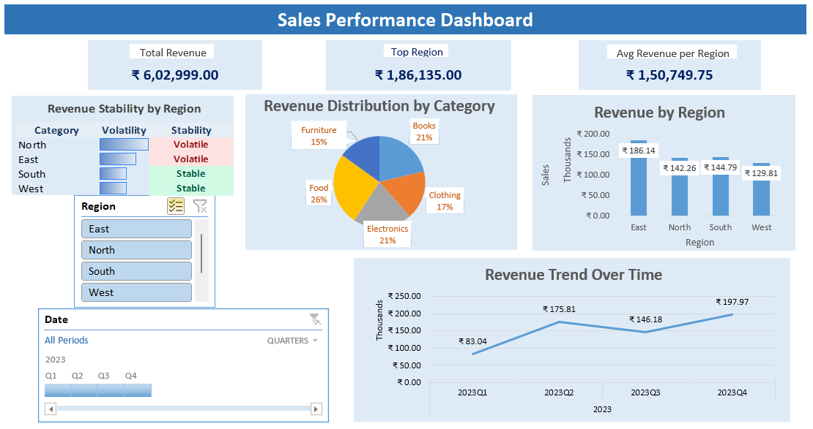

# 📈 Excel Sales KPI Dashboard

---

## 📌 Project Overview

This project presents an interactive Sales Performance Dashboard built entirely in Microsoft Excel. The dashboard enables dynamic business analysis across regions and product categories while tracking revenue performance over time.

The goal was to simulate a real-world business reporting environment and deliver clear, executive-level insights using Excel-based analytics techniques.

---

## 🎯 Business Objectives

The dashboard was designed to help stakeholders:

- Monitor overall revenue performance
- Identify top-performing regions
- Compare regional sales contribution
- Analyze product category distribution
- Track quarterly revenue trends
- Evaluate revenue stability across regions
- Filter data dynamically using slicers and timeline controls

---

## 📈 Key Performance Indicators (KPIs)

- **Total Revenue**
- **Top Performing Region**
- **Average Revenue per Region**
- **Regional Revenue Comparison**
- **Category Revenue Distribution**
- **Quarterly Revenue Trend**
- **Revenue Stability Analysis (Volatility by Region)**

---

## 🛠 Tools & Techniques Used

- Microsoft Excel
- Pivot Tables for dynamic aggregation
- Pivot Charts for visual reporting
- Slicers for interactive region filtering
- Timeline for date-based filtering
- Dynamic KPI Cards using cell-linked shapes
- Conditional Formatting (Data Bars & Status Indicators)
- Structured dashboard layout design

---

## 📷 Dashboard Preview

---

## 📥 Download

You can download and explore the interactive Excel dashboard here:

➡️ [Excel_Sales_Performance_Dashboard.xlsx](Excel_Sales_Performance_Dashboard.xlsx)

---

## 📊 Dashboard Features

✔ Interactive filtering (Region & Quarter)  
✔ Dynamic KPI cards updating with slicer selection  
✔ Regional performance comparison  
✔ Revenue distribution by category  
✔ Quarterly revenue trend visualization  
✔ Revenue volatility classification (Stable vs Volatile)  
✔ Clean, executive-style layout  

---

## 📂 File Structure

- **Raw_Data** → Original dataset used for analysis  
- **Dashboard** → Final interactive reporting dashboard  

---

## ▶ How to Use this Dashboard

1. Download and open the Excel file in Microsoft Excel (Desktop version recommended).
2. Use the **Region slicer** to filter sales by region.
3. Use the **Date timeline** to filter quarterly performance.
4. Observe how KPI cards and charts dynamically update.
5. Review Revenue Stability section for volatility analysis.

---

## 💡 Business Insights

- Identified the highest revenue-generating region  
- Compared regional contribution to total revenue  
- Analyzed product category performance distribution  
- Evaluated revenue consistency across regions  
- Observed quarterly growth patterns  

---

## 🚀 Skills Demonstrated

Excel Analytics | Business Intelligence | Data Visualization | KPI Reporting | Dashboard Design | Analytical Thinking | Performance Analysis

---

## 🔎 Project Type

Portfolio Project – Excel Data Analytics & Business Reporting

---

## 👨‍💻 Author

**Umesh Zampadiya**  
Aspiring Data Analyst | Excel & Operations Reporting Specialist

Linkdin: https://www.linkedin.com/in/umeshzampadiya/
